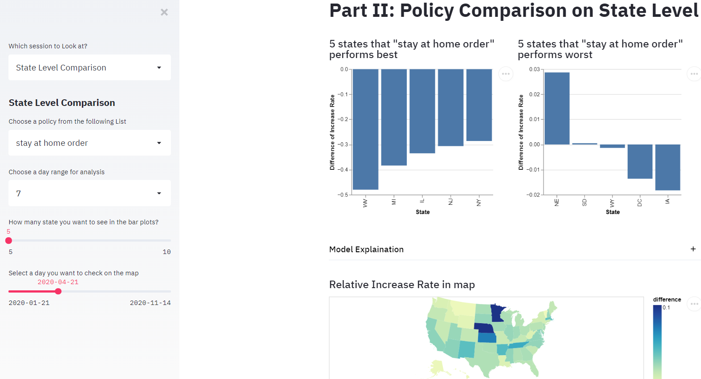

# BIOSTAT823-Final-Project

This is the final project of BIOSTAT823: Statistical Programming for Big Data in 2020 Fall Semester at Duke. Our team name is "Durham Sloths". This project is finished by Zhuoran Hou([https://github.com/ZhuoranHou](https://github.com/ZhuoranHou)), Qianyin Lu ([https://github.com/QianyinLu](https://github.com/QianyinLu)), Jishen Yin ([https://github.com/YinJishen](https://github.com/YinJishen)) and Zewen Zhang ([https://github.com/zewenzhang1007](https://github.com/zewenzhang1007))(ordered by initials).

### 1.Data collection and data cleaning

After discussion, we planned to collect data from the following 5 parts:

- COVID-19 cases in US from January till now

  https://data.cdc.gov/Case-Surveillance/United-States-COVID-19-Cases-and-Deaths-by-State-o/9mfq-cb36

- COVID-19 patient-level data

  https://data.cdc.gov/Case-Surveillance/COVID-19-Case-Surveillance-Public-Use-Data/vbim-akqf

- hospital resources (Hospital Capacity by State)

  https://www.cdc.gov/nhsn/covid19/report-patient-impact.html#anchor_1594393649

- COVID-19 US State Policy 

  https://github.com/USCOVIDpolicy/COVID-19-US-State-Policy-Database

- State demographic information

  https://www.census.gov/data/developers/data-sets/acs-1year.html

We download all the data through API from the website or just through the URL,  and cleaned the data to make it at least meet the requirement of 1NF.

### 2.Data analysis and Modeling

There are four parts of the analysis:

1.Overview of the COVID-19 cases and death cases by states in US (updated everyday)

No models used here.

2.Comparison of the influence of policies on the increase rate of case among states

3.Predict case growth rate using hospital capacity, state demographic information and related policies based on Random forest.

4.Explore how sex, age race and commodity affect the development of COVID-19 from a individual level (Transform the data into SQL database; Used Stratified sampling in this part)

### 3.Data visualization and Development of data product

We used streamlit to build a dashboard to show our data and analysis results.

There are four parts of the dashboard: 

1.Overview of the COVID-19 cases and death cases by states in US (updated everyday)

- The trend of new cases and new death cases from January till now by state.

- Map plot showing total cases,  new cases, cases per million people, death per million people based the latest data.

  

2.Comparison of the influence of policies on the increase rate of case among states

- Top 5 states with worse/best policy performance based on 7/15 day ranges

- Map plot showing the relative Increase Rate of individual states compare to the US

  

3.Predict case growth rate using hospital capacity, state demographic information and related policies based on Random forest.

- Feature Importance plot for the entire U.S. level

- Actual VS Predicted daily case growth rate for each state

- Feature Importance plot for the individual state level

- Pie chart showing state's Sex ratio, race ratio 

- Bar plot of age groups, data table of the state's demographic information 

  

4.Explore how sex, age race and commodity affect the development of COVID-19 from a individual level

- Sampling process of original data

- Tree plot of data specified by age_group

- Death cases count/rate for each age group; Infection cases count/rate for each age group (faceted by gender)

- Death cases count/rate for each race; Infection cases count/rate for each race (faceted by gender)

  

### 4. Deployment
Refer to this [GitHub](https://github.com/QianyinLu/finalproject1)   

**Our final data product can be access from [here](https://final-project-823.herokuapp.com/)**

### 5.Related techniques used 

- Random forest (with cross validation, grid search and feature importance computation)
- SQL database, database normalization (also implementing stratified sampling)
- API
- Interactive plot (`altair`, `plotly`)
- `numpy`, `pandas` manipulation
- `streamlit`
- Functional programming
